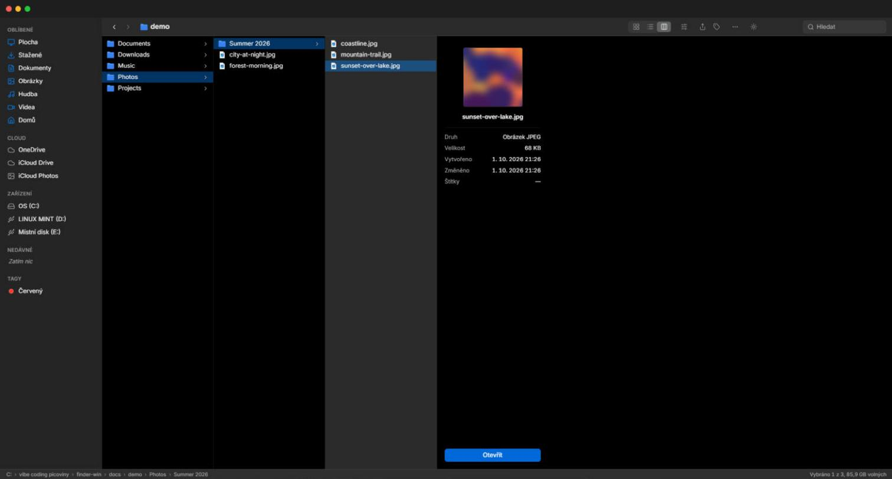
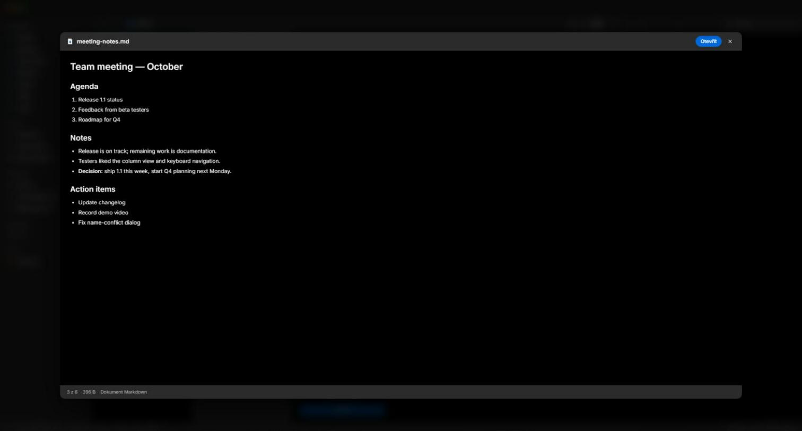
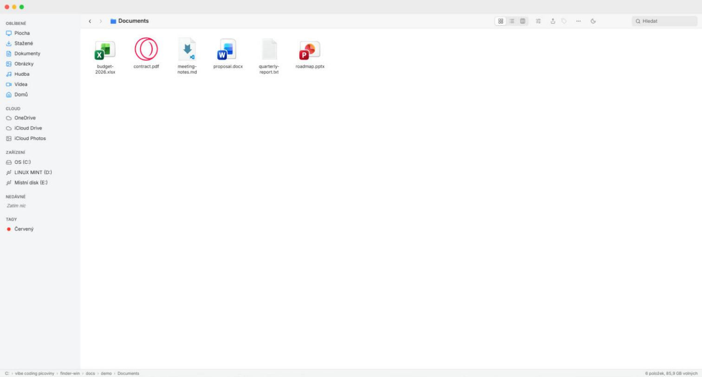

# Finder-Win

[English](README.md) · **Čeština**

Správce souborů pro Windows ve stylu macOS Finderu, postavený na Tauri 2, Reactu a Rustu.

## Screenshoty





## Funkce

- **Tři režimy zobrazení** – Ikony, Seznam (řaditelné sloupce, pruhované řádky) a Sloupce (Miller columns s info panelem vybraného souboru).
- **Okno ve stylu macOS** – vlastní titulkový pruh se „semaforem“, zaoblené rohy, tenké scrollbary.
- **Postranní panel**
  - standardní složky (Plocha, Stažené, Dokumenty, Obrázky, Hudba, Videa, Domů), OneDrive / iCloud Drive, pokud existují,
  - **všechny připojené disky** (USB disky s vlastní ikonou) a telefony / fotoaparáty; seznam se aktualizuje hned po připojení nebo odpojení,
  - **vlastní oblíbené** – přetažením složek nebo souborů do panelu je přidáš, tažením přeuspořádáš, pravým klikem přejmenuješ nebo odebereš; ukládá se mezi spuštěními,
  - **Nedávné** – naposledy otevřené položky s relativním časem,
  - **Tagy** – použité barvy s počtem položek,
  - sekce se dají sbalit.
- **Výběr** – Ctrl+klik, Shift+klik, Shift+šipky a gumičkový výběr tažením v prázdné ploše (ve všech zobrazeních).
- **Přetahování uvnitř aplikace** – položky přetažené na složku se přesunou (s Ctrl zkopírují); do panelu se přidají do oblíbených.
- **Kolize názvů** – při vložení nebo přetažení nabídne dialog *Nahradit* (složky se sloučí), *Ponechat obě* nebo *Přeskočit*, včetně *Použít pro všechny*.
- **Quick Look** (mezerník) – náhled obrázků, PDF, videa, zvuku, textu/zdrojáků a vykresleného Markdownu; ←/→ přepíná soubory.
- **Souborové operace** – přejmenování na místě, duplikace, nová složka / nový soubor, přesun do koše (na discích bez koše se nejdřív zeptá), kopírovat / vyjmout / vložit v rámci aplikace, Otevřít v aplikaci…, otevřít v Průzkumníku, otevřít ve Windows Terminálu, kopírovat cestu / název, vlastnosti včetně velikosti složky.
- **Toolbar** – Seřadit (podle názvu, data, velikosti, druhu), Sdílet (kopírovat cestu, otevřít v Průzkumníku), Štítky pro celý výběr.
- **Kontextová menu** na souborech, volné ploše, v panelu, ve stavovém řádku i v Quick Look, ovladatelná i klávesnicí.
- **Barevné tagy** – 7 barev jako ve Finderu; při přejmenování nebo přesunu v aplikaci jdou s položkou.
- **Hledání** – psaní filtruje aktuální složku, Enter spustí rekurzivní hledání podle názvu (Esc ho zruší).
- **Skryté soubory** – řídí se nastavením Průzkumníku, přepínají se Ctrl+Shift+.
- **Živá aktualizace** – výpis složky se sám obnoví, když se soubory na disku změní.
- **Světlý a tmavý režim**, plynulé animace jako na macOS (vypnou se, když je ve Windows zapnuté omezení animací), funguje offline.

## Klávesové zkratky

| Zkratka | Akce |
|---|---|
| `↑` `↓` `←` `→` | Posun výběru (Ikony po mřížce, Sloupce mezi sloupci) |
| `Shift` + šipky / klik | Rozšířit výběr |
| `Ctrl` + klik | Přidat / odebrat položku z výběru |
| `Home` / `End`, `PgUp` / `PgDn` | První / poslední položka, o stránku nahoru / dolů |
| Psaní písmen | Skok na položku, jejíž název jimi začíná |
| `Enter` / `Ctrl+↓` | Otevřít vybranou položku |
| `Mezerník` | Quick Look |
| `Backspace` / `Alt+←` | Zpět |
| `Alt+→` | Vpřed |
| `Alt+↑` / `Ctrl+↑` | Nadřazená složka |
| `Ctrl+L` | Editace cesty |
| `Ctrl+F` | Pole hledání (`Enter` = rekurzivní hledání, `↓` = do výsledků, `Esc` = vymazat) |
| `Ctrl+C` / `Ctrl+X` / `Ctrl+V` | Kopírovat / vyjmout / vložit |
| `Ctrl+D` | Duplikovat |
| `Ctrl+A` | Vybrat vše (ne ve sloupcovém zobrazení) |
| `Ctrl+Shift+N` | Nová složka |
| `F2` | Přejmenovat |
| `Delete` | Přesunout do koše |
| `Ctrl+R` / `F5` | Obnovit |
| `Ctrl+Shift+.` | Zobrazit / skrýt skryté soubory |
| `Esc` | Zrušit výběr; zavřít výsledky hledání; zavřít menu a dialogy |
| `←` / `→`, `Esc` | Předchozí / další soubor, zavřít (v Quick Look) |
| Tlačítko myši 4 / 5 | Zpět / vpřed |

## Instalace

Stáhni nejnovější `Finder-Win_…_x64-setup.exe` ze stránky [Releases](https://github.com/OWNER/finder-win/releases/latest) a spusť ho. Instaluje se jen pro aktuálního uživatele, práva administrátora nejsou potřeba.

### Varování Windows SmartScreen

Instalátor není digitálně podepsaný, takže Windows SmartScreen zobrazí „Systém Windows ochránil váš počítač“. Pro instalaci klikni na **Další informace** a pak **Přesto spustit**.

## Sestavení ze zdrojáků

Potřebuješ:

- [Node.js](https://nodejs.org/) 20+
- [Rust](https://rustup.rs/) (stable)
- [Microsoft C++ Build Tools](https://visualstudio.microsoft.com/visual-cpp-build-tools/) („Vývoj desktopových aplikací pomocí C++“)
- WebView2 (ve Windows 10/11 už je)

```powershell
npm install
npm run tauri dev     # vývojový režim
npm run tauri build   # sestavení instalátoru
```

Instalátor vznikne v `src-tauri/target/release/bundle/nsis/`.

## Známá omezení

- **Rozhraní je jen česky**, lokalizace zatím není.
- **Jen pro Windows.**
- **Bez Zpět (Undo)** – smazané jde do koše, ale přejmenování, přesuny a nahrazení se z aplikace vrátit nedají.
- **Bez schránky Windows pro soubory** – kopírovat / vyjmout / vložit funguje jen uvnitř aplikace; do Průzkumníku ani z něj soubory vložit nejde. „Kopírovat cestu“ systémovou schránku používá.
- **Bez tažení do Průzkumníku a z něj** – drag & drop funguje jen uvnitř aplikace.
- **Bez ikon ze shellu** – `.lnk`, `.exe` a další soubory mají obecnou ikonu podle typu, ne tu, kterou ukazují Windows. Náhledy obrázků také nejsou.
- **Telefony a fotoaparáty** (iPhone, Android — zařízení MTP) jsou v panelu vidět, ale klik je otevře v Průzkumníku Windows; přímo v aplikaci se procházet nedají.
- Rekurzivní hledání porovnává **jen názvy souborů**, končí na **500 výsledcích** a přeskakuje složky `.git`, `node_modules` a rustové `target` (jen ty vedle `Cargo.toml`).
- Žádné taby ani víc oken.
- Instalátor **není podepsaný** (viz SmartScreen výše).

## Licence

[MIT](LICENSE)
