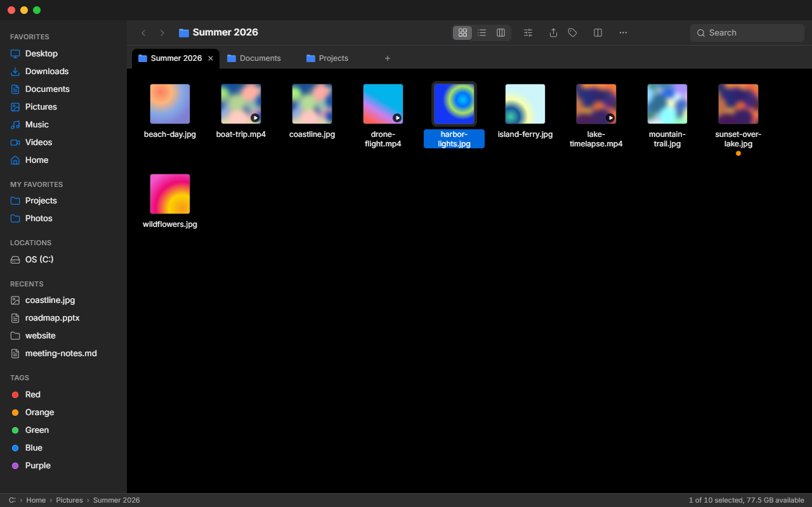
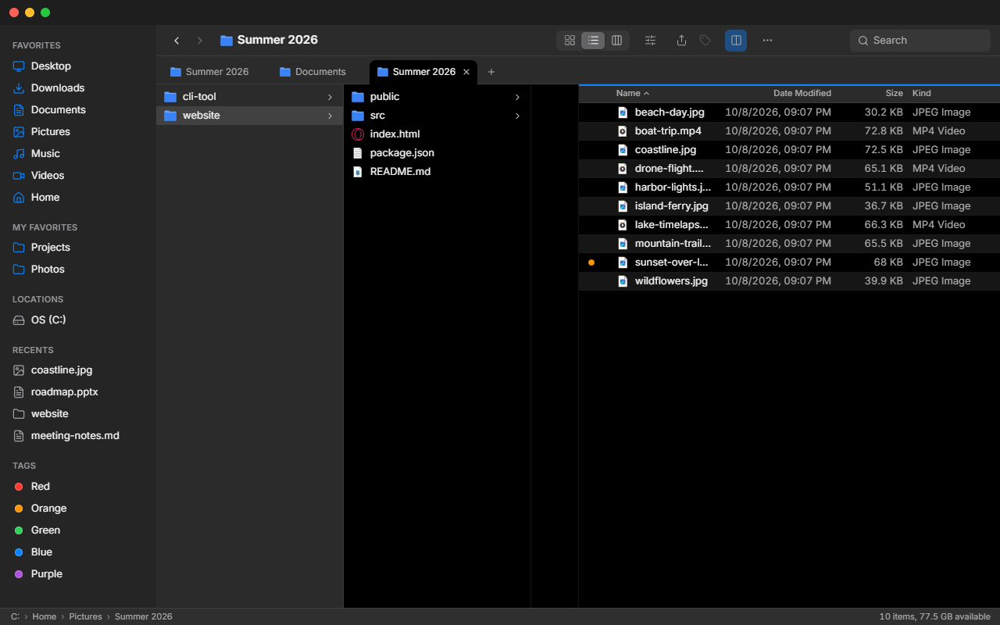
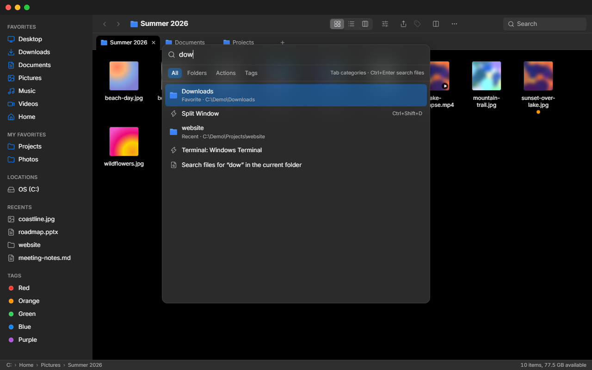
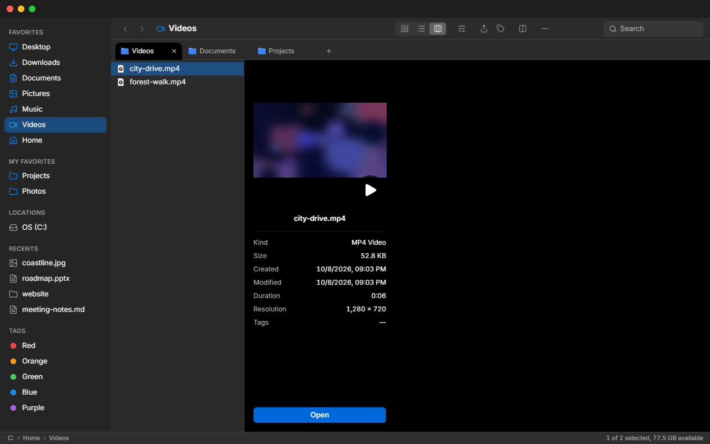

<div align="center">


# Finder-Win

**Zážitek z macOS Finderu, ve Windows.**

[English](README.md) · **Čeština**

[](https://github.com/krystof2-ops/finder-win/releases/latest)
[](https://github.com/krystof2-ops/finder-win/releases)
[](LICENSE)


### [⬇ Stáhnout pro Windows](https://github.com/krystof2-ops/finder-win/releases/latest)

nebo: `winget install krystof2-ops.FinderWin` *(brzy)*


</div>

## Proč Finder-Win?

- **Sloupcové zobrazení** – Miller columns s náhledovým panelem, jak Finder prochází hluboké stromy složek. Průzkumník nic takového nemá.
- **Klávesnice na prvním místě** – Ctrl+K otevře paletu příkazů se složkami, akcemi a štítky; mezerník otevře Quick Look.
- **Dva panely v jednom okně** – rozdělené okno s kopírováním a přesunem přes F5 / F6, bez druhého okna Průzkumníku.
- **Malý a lokální** – instalátor pod 3 MB (Tauri: Rust + WebView2), instaluje se pro uživatele bez práv správce, bez účtu a bez telemetrie.

## Funkce

### Procházení jako ve Finderu

<picture>
  <source media="(prefers-color-scheme: light)" srcset="docs/screenshots/hero-light.png">
  
</picture>

- Zobrazení **Ikony, Seznam a Sloupce**; náhledy obrázků, videí (s odznakem ▶) a PDF.
- **Záložky** – každá s vlastní historií, zobrazením, řazením a výběrem; přerovnání tažením, soubor puštěný na záložku se přesune do její složky.
- **Světlý a tmavý režim** podle Windows, nebo nastavený v Více → Vzhled. Rozhraní česky a anglicky.

### Rozdělené okno



- **Ctrl+Shift+D** rozdělí okno na dva nezávislé panely; `Tab` mezi nimi přepíná.
- **F5 / F6** zkopíruje nebo přesune výběr do druhého panelu, jako v Total Commanderu.
- Poměr panelů jde táhnout dělicí čárou (dvojklik = 1:1) a ukládá se.

### Paleta příkazů



- **Ctrl+K** hledá složky (oblíbené, nedávné, záložky, podsložky), akce a štítky.
- `~` nebo cestu můžeš zadat přímo; **Ctrl+Enter** hledá soubory v aktuální složce.
- U akcí je vidět klávesová zkratka a nejpoužívanější příkazy jsou nahoře.

### Náhledy a Quick Look



- Náhledový sloupec ukáže náhled a u videí **délku a rozlišení**, u obrázků rozměry, u PDF počet stran.
- **Mezerník** otevře Quick Look pro obrázky, PDF, video, zvuk, text a zdrojáky i vykreslený Markdown; ←/→ přepíná soubory.
- Náhledy a ikony se cachují lokálně v `%LOCALAPPDATA%\finder-win`.

### Běžná práce se soubory

- **Skutečná schránka Windows** – Ctrl+C / Ctrl+X / Ctrl+V fungují s Průzkumníkem, Outlookem i prohlížeči; soubory jde přetáhnout dovnitř z Průzkumníku nebo z plochy.
- **Zpět / Znovu** (Ctrl+Z / Ctrl+Y) pro posledních 50 přejmenování, přesunů, kopií, nových položek, smazání a změn štítků.
- **Postranní panel** se standardními složkami, všemi disky (aktualizuje se po připojení USB), vlastními oblíbenými, nedávnými a barevnými štítky jako ve Finderu.

## Klávesové zkratky

| Zkratka | Akce |
|---|---|
| `Ctrl+T` | Nová záložka |
| `Ctrl+W` | Zavřít záložku |
| `Ctrl+K` | Paleta příkazů (`Ctrl+Enter` = hledat soubory) |
| `Ctrl+Shift+D` | Rozdělit okno na dva panely |
| `F5` / `F6` | Kopírovat / přesunout výběr do druhého panelu (rozdělené okno) |
| `Mezerník` | Quick Look |
| `Ctrl+Z` / `Ctrl+Y` | Zpět / znovu |

<details>
<summary>Všechny zkratky</summary>

| Zkratka | Akce |
|---|---|
| `↑` `↓` `←` `→` | Posun výběru (Ikony po mřížce, Sloupce mezi sloupci) |
| `Shift` + šipky / klik | Rozšířit výběr |
| `Ctrl` + klik | Přidat / odebrat položku z výběru |
| `Home` / `End`, `PgUp` / `PgDn` | První / poslední položka, o stránku nahoru / dolů |
| Psaní písmen | Skok na položku, jejíž název jimi začíná |
| `Enter` / `Ctrl+↓` | Otevřít vybranou položku |
| `Backspace` / `Alt+←` | Zpět |
| `Alt+→` | Vpřed |
| `Alt+↑` / `Ctrl+↑` | Nadřazená složka |
| `Ctrl+L` | Editace cesty |
| `Ctrl+F` | Pole hledání (`Enter` = rekurzivní hledání, `↓` = do výsledků, `Esc` = vymazat) |
| `Ctrl+C` / `Ctrl+X` / `Ctrl+V` | Kopírovat / vyjmout / vložit (schránka Windows) |
| `Ctrl+Shift+Z` | Znovu |
| `Tab` | Přepnout aktivní panel (rozdělené okno) |
| `Ctrl+Tab` / `Ctrl+Shift+Tab` | Další / předchozí záložka |
| `Ctrl+1` … `Ctrl+9` | Záložka 1–8 / poslední záložka |
| `Ctrl+D` | Duplikovat |
| `Ctrl+A` | Vybrat vše (ne ve sloupcovém zobrazení) |
| `Ctrl+Shift+N` | Nová složka |
| `F2` | Přejmenovat |
| `Delete` | Přesunout do koše |
| `Ctrl+R` / `F5` | Obnovit (`F5` mimo rozdělené okno) |
| `Ctrl+Shift+.` | Zobrazit / skrýt skryté soubory |
| `Esc` | Zrušit výběr; zavřít výsledky hledání; zavřít menu a dialogy |
| `←` / `→`, `Esc` | Předchozí / další soubor, zavřít (v Quick Look) |
| Tlačítko myši 4 / 5 | Zpět / vpřed |
| Prostřední klik na složku / záložku | Otevřít v nové záložce / zavřít záložku |

</details>

## Instalace

1. Stáhni `Finder-Win_…_x64-setup.exe` z [poslední verze](https://github.com/krystof2-ops/finder-win/releases/latest) a spusť ho. Instaluje se jen pro aktuálního uživatele, práva správce nejsou potřeba.
2. Instalátor není digitálně podepsaný, takže Windows SmartScreen ukáže „Systém Windows ochránil váš počítač“. Klikni na **Další informace** → **Přesto spustit**.

Připravujeme: **winget** (`winget install krystof2-ops.FinderWin`; manifest je ve složce [`winget/`](winget)) a **Microsoft Store**.

<details>
<summary>Známá omezení</summary>

- Jen pro Windows.
- Historie Zpět platí jen za běhu aplikace. Soubor přepsaný volbou *Nahradit* se vrátit nedá.
- Soubory jde do Finder-Winu přetáhnout, ale ne ven do Průzkumníku nebo jiných aplikací – místo toho Ctrl+C a vložit tam.
- Telefony a fotoaparáty (MTP) jsou v panelu vidět, ale otevřou se v Průzkumníku Windows.
- Rekurzivní hledání porovnává jen názvy souborů a končí na 500 výsledcích.
- Záložky ano, víc oken ne.

</details>

## Soukromí

Finder-Win dělá jediný druh síťového požadavku: nejvýš jednou denně se zeptá GitHub API (`api.github.com/repos/krystof2-ops/finder-win/releases/latest`), jestli existuje novější verze, a pokud ano, ukáže proužek s odkazem na stránku vydání. Žádná telemetrie, nic o tobě ani o tvých souborech se neodesílá. Vypnout jde v Více → Kontrolovat aktualizace.

## Sestavení ze zdrojáků

Potřebuješ [Node.js](https://nodejs.org/) 20+, [Rust](https://rustup.rs/) (stable), [Microsoft C++ Build Tools](https://visualstudio.microsoft.com/visual-cpp-build-tools/) („Vývoj desktopových aplikací pomocí C++“) a WebView2 (ve Windows 10/11 už je).

```powershell
npm install
npm run tauri dev     # vývojový režim
npm run tauri build   # instalátor → src-tauri/target/release/bundle/nsis/
```

## Přispívání

Chyby a pull requesty vítány v [Issues](https://github.com/krystof2-ops/finder-win/issues). Před PR spusť `npm run build` a v `src-tauri` `cargo clippy -- -D warnings` a `cargo test`. Texty UI jdou přes překlady v `src/i18n/` (čeština a angličtina). Bezpečnostní problémy: viz [SECURITY.md](SECURITY.md).

Seznam změn je v [CHANGELOG.md](CHANGELOG.md) (anglicky).

## Licence

[MIT](LICENSE)
