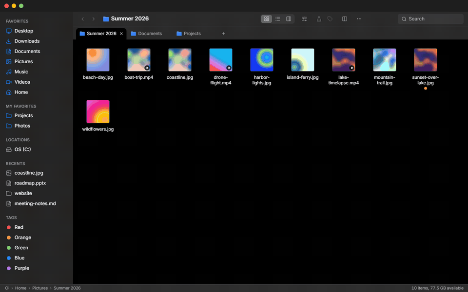

# Finder-Win

[](https://github.com/krystof2-ops/finder-win/releases/latest)  



[English](README.md) · **Čeština**

Správce souborů pro Windows ve stylu macOS Finderu, postavený na Tauri 2, Reactu a Rustu.

## Screenshoty


## Funkce

- **Tři režimy zobrazení** – Ikony, Seznam (řaditelné sloupce, pruhované řádky) a Sloupce (Miller columns s info panelem vybraného souboru).
- **Záložky** – Ctrl+T otevře aktuální složku v nové záložce, prostřední klik nebo *Otevřít v nové záložce* otevře složku; každá záložka má vlastní historii, zobrazení, řazení, výběr i hledání. Přetažením se přerovnávají, soubor puštěný na záložku se přesune do její složky; při dalším spuštění se obnoví.
- **Okno ve stylu macOS** – vlastní titulkový pruh se „semaforem“, zaoblené rohy, tenké scrollbary.
- **Postranní panel**
  - standardní složky (Plocha, Stažené, Dokumenty, Obrázky, Hudba, Videa, Domů), OneDrive / iCloud Drive, pokud existují,
  - **všechny připojené disky** (USB disky s vlastní ikonou) a telefony / fotoaparáty; seznam se aktualizuje hned po připojení nebo odpojení,
  - **vlastní oblíbené** – přetažením složek nebo souborů do panelu je přidáš, tažením přeuspořádáš, pravým klikem přejmenuješ nebo odebereš; ukládá se mezi spuštěními,
  - **Nedávné** – naposledy otevřené položky s relativním časem,
  - **Tagy** – použité barvy s počtem položek,
  - sekce se dají sbalit.
- **Výběr** – Ctrl+klik, Shift+klik, Shift+šipky a gumičkový výběr tažením v prázdné ploše (ve všech zobrazeních).
- **Přetahování** – položky přetažené na složku, místo v panelu nebo záložku se přesunou (s Ctrl zkopírují); do *Moje oblíbené* se přidají do oblíbených. Soubory přetažené z Průzkumníku nebo z plochy padnou do složky pod kurzorem, jinak do aktuální složky.
- **Schránka Windows** – Ctrl+C / Ctrl+X dávají do schránky skutečné soubory: vložíš je v Průzkumníku, přiložíš v Outlooku nebo ve webovém mailu, a soubory zkopírované v Průzkumníku vložíš do Finder-Winu. Vyjmuté se přesunou a schránka se vyprázdní, jako v Průzkumníku.
- **Zpět / Znovu** – Ctrl+Z / Ctrl+Shift+Z pro posledních 50 přejmenování, přesunů, kopií, nových položek, smazání (obnoví z Koše) a změn štítků; menu Více ukáže, co se vrátí.
- **Kolize názvů** – při vložení nebo přetažení nabídne dialog *Nahradit* (složky se sloučí), *Ponechat obě* nebo *Přeskočit*, včetně *Použít pro všechny*.
- **Quick Look** (mezerník) – náhled obrázků, PDF, videa, zvuku, textu/zdrojáků a vykresleného Markdownu; ←/→ přepíná soubory.
- **Souborové operace** – přejmenování na místě, duplikace, nová složka / nový soubor, přesun do koše (na discích bez koše se nejdřív zeptá), kopírovat / vyjmout / vložit, Otevřít v aplikaci…, otevřít v Průzkumníku, otevřít ve Windows Terminálu, kopírovat cestu / název, vlastnosti včetně velikosti složky.
- **Toolbar** – Seřadit (podle názvu, data, velikosti, druhu), Sdílet (kopírovat cestu, kopírovat soubory, otevřít v Průzkumníku), Štítky pro celý výběr.
- **Kontextová menu** na souborech, volné ploše, v panelu, ve stavovém řádku i v Quick Look, ovladatelná i klávesnicí.
- **Barevné tagy** – 7 barev jako ve Finderu; při přejmenování nebo přesunu v aplikaci jdou s položkou.
- **Hledání** – psaní filtruje aktuální složku, Enter spustí rekurzivní hledání podle názvu (Esc ho zruší).
- **Skryté soubory** – řídí se nastavením Průzkumníku, přepínají se Ctrl+Shift+.
- **Živá aktualizace** – výpis složky se sám obnoví, když se soubory na disku změní.
- **Světlý a tmavý režim**, plynulé animace jako na macOS (vypnou se, když je ve Windows zapnuté omezení animací), funguje offline.
- **Rozhraní anglicky a česky, řídí se jazykem Windows** – přepnout jde kdykoli v menu Více → Language / Jazyk.
- **Instalace přes winget** a volitelná kontrola aktualizací jednou denně (viz níže).

## Klávesové zkratky

| Zkratka | Akce |
|---|---|
| `↑` `↓` `←` `→` | Posun výběru (Ikony po mřížce, Sloupce mezi sloupci) |
| `Shift` + šipky / klik | Rozšířit výběr |
| `Ctrl` + klik | Přidat / odebrat položku z výběru |
| `Home` / `End`, `PgUp` / `PgDn` | První / poslední položka, o stránku nahoru / dolů |
| Psaní písmen | Skok na položku, jejíž název jimi začíná |
| `Enter` / `Ctrl+↓` | Otevřít vybranou položku |
| `Mezerník` | Quick Look |
| `Backspace` / `Alt+←` | Zpět |
| `Alt+→` | Vpřed |
| `Alt+↑` / `Ctrl+↑` | Nadřazená složka |
| `Ctrl+L` | Editace cesty |
| `Ctrl+F` | Pole hledání (`Enter` = rekurzivní hledání, `↓` = do výsledků, `Esc` = vymazat) |
| `Ctrl+C` / `Ctrl+X` / `Ctrl+V` | Kopírovat / vyjmout / vložit (schránka Windows) |
| `Ctrl+Z` | Zpět |
| `Ctrl+Shift+Z` / `Ctrl+Y` | Znovu |
| `Ctrl+T` / `Ctrl+W` | Nová záložka / zavřít záložku |
| `Ctrl+Tab` / `Ctrl+Shift+Tab` | Další / předchozí záložka |
| `Ctrl+1` … `Ctrl+9` | Záložka 1–8 / poslední záložka |
| `Ctrl+D` | Duplikovat |
| `Ctrl+A` | Vybrat vše (ne ve sloupcovém zobrazení) |
| `Ctrl+Shift+N` | Nová složka |
| `F2` | Přejmenovat |
| `Delete` | Přesunout do koše |
| `Ctrl+R` / `F5` | Obnovit |
| `Ctrl+Shift+.` | Zobrazit / skrýt skryté soubory |
| `Esc` | Zrušit výběr; zavřít výsledky hledání; zavřít menu a dialogy |
| `←` / `→`, `Esc` | Předchozí / další soubor, zavřít (v Quick Look) |
| Tlačítko myši 4 / 5 | Zpět / vpřed |
| Prostřední klik na složku / záložku | Otevřít v nové záložce / zavřít záložku |

## Instalace

Stáhni nejnovější `Finder-Win_…_x64-setup.exe` ze stránky [Releases](https://github.com/krystof2-ops/finder-win/releases/latest) a spusť ho. Instaluje se jen pro aktuálního uživatele, práva administrátora nejsou potřeba.

### Varování Windows SmartScreen

Instalátor není digitálně podepsaný, takže Windows SmartScreen zobrazí „Systém Windows ochránil váš počítač“. Pro instalaci klikni na **Další informace** a pak **Přesto spustit**.

### winget

```powershell
winget install krystof2-ops.FinderWin
```

Manifest je ve složce [`winget/`](winget) (formát 1.6). Po publikování release stáhne workflow *Update winget manifest* instalátor, přepočítá SHA256 a otevře pull request do tohoto repozitáře (je k tomu potřeba povolit *Settings → Actions → General → Allow GitHub Actions to create and approve pull requests*). Odeslání do [microsoft/winget-pkgs](https://github.com/microsoft/winget-pkgs) se dělá ručně, buď přes [wingetcreate](https://github.com/microsoft/winget-create):

```powershell
wingetcreate submit --token <GITHUB_PAT> winget
```

nebo pull requestem, který zkopíruje tři soubory do `manifests/k/krystof2-ops/FinderWin/<verze>/` ve winget-pkgs (nejdřív ověř přes `winget validate winget`).

### Kontrola aktualizací

Nejvýš jednou denně se aplikace zeptá `https://api.github.com/repos/krystof2-ops/finder-win/releases/latest`, jestli existuje novější verze, a pokud ano, ukáže dole nenápadný proužek s odkazem na stránku vydání. Ten jeden GET je jediný síťový požadavek aplikace — žádná telemetrie, nic se neodesílá. Vypnout jde v menu Více → Kontrolovat aktualizace.

## Sestavení ze zdrojáků

Potřebuješ:

- [Node.js](https://nodejs.org/) 20+
- [Rust](https://rustup.rs/) (stable)
- [Microsoft C++ Build Tools](https://visualstudio.microsoft.com/visual-cpp-build-tools/) („Vývoj desktopových aplikací pomocí C++“)
- WebView2 (ve Windows 10/11 už je)

```powershell
npm install
npm run tauri dev     # vývojový režim
npm run tauri build   # sestavení instalátoru
```

Instalátor vznikne v `src-tauri/target/release/bundle/nsis/`.

## Známá omezení

- **Jen pro Windows.**
- **Historie Zpět se neukládá** – platí jen za běhu aplikace (posledních 50 operací). Soubor přepsaný volbou *Nahradit* se vrátit nedá a Zpět u kopie nebo nové položky na disku bez Koše se odmítne, místo aby smazalo natrvalo.
- **Bez tažení ven z aplikace** – soubory jde do Finder-Winu přetáhnout z Průzkumníku, ale ne z Finder-Winu do Průzkumníku, na plochu ani do jiných aplikací. Místo toho Ctrl+C a vložit tam.
- **Telefony a fotoaparáty** (iPhone, Android — zařízení MTP) jsou v panelu vidět, ale klik je otevře v Průzkumníku Windows; přímo v aplikaci se procházet nedají.
- Rekurzivní hledání porovnává **jen názvy souborů**, končí na **500 výsledcích** a přeskakuje složky `.git`, `node_modules` a rustové `target` (jen ty vedle `Cargo.toml`).
- Záložky ano, víc oken ne. Záložky se při startu obnoví jen tehdy, když jsou otevřené 2 a více, a jen se svou složkou, zobrazením a řazením (historie a výběr začínají znovu).
- Instalátor **není podepsaný** (viz SmartScreen výše).

## Changelog

### 1.3.0

- **Záložky** – Ctrl+T / Ctrl+W / Ctrl+Tab / Ctrl+1…9, prostřední klik a *Otevřít v nové záložce*; každá záložka má vlastní historii, zobrazení, řazení, výběr, sloupce i hledání; přerovnání tažením, drop souboru na záložku, obnovení při startu (složka, zobrazení a řazení).
- **Schránka Windows** – kopírování / vyjmutí / vložení souborů mezi Finder-Winem, Průzkumníkem, Outlookem a prohlížeči (CF_HDROP).
- **Drag & drop z Průzkumníku** – soubory z Průzkumníku nebo z plochy jde pustit na složku, položku panelu, záložku i do prázdné plochy.
- **Zpět / Znovu** – přejmenování, přesun, kopie, nová položka, smazání (z Koše) a štítky, posledních 50 operací.
- **Manifest pro winget** a vypínatelná kontrola aktualizací (jeden GET na GitHub API denně, žádná telemetrie).

### 1.2.0

- **Anglické rozhraní, přepínač jazyka, data, velikosti a plurály podle jazyka** – aplikace se řídí jazykem Windows (angličtina nebo čeština) a přepnout ji jde v menu Více → Language / Jazyk bez restartu.

### 1.1.0

- **Opravy z auditu** – logika výběru a navigace, bezpečnější souborové operace, zpřísnění bezpečnosti a konfigurace.
- **Vícenásobný výběr a klávesová navigace** – výběr s Ctrl/Shift, šipky ve všech zobrazeních, tlačítka Seřadit, Sdílet a Štítky v toolbaru.
- **Dialog kolizí** – vložení a přesun se zeptají, co dělat, když soubor se stejným názvem už existuje (nahradit, ponechat oba, přeskočit).
- **Nový design s ikonami ze shellu** – skutečné ikony souborů z Windows, složky ve stylu Sonoma, náhledy obrázků, přepracovaný toolbar, sidebar, zobrazení a dialogy, kontrast WCAG AA v obou tématech.
- **Animace a virtualizace** – virtualizované výpisy se streamovaným načítáním složek, navigace bez skoků, mikrointerakce, plynulejší scroll a podpora `prefers-reduced-motion`.

## Licence

[MIT](LICENSE)
